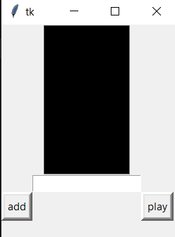
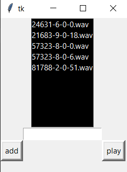
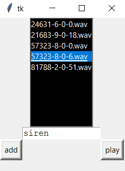
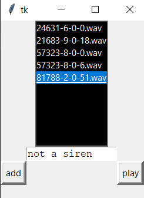

# Siren_detection_with_ANN

### Is's a college mini porject done by group of three people including myself.

We trained a model for audio classification which uses normalised mfcc features to training and predictions

### We have done ANN model rather than a CNN model for two reason
  1: CNN models are very complex and hard to train and it takes a lot of time and computing power  
  2: Where for ANN a single vector of fecatures is enough for the training and prediction and it is the fatstest of two 

### On accuracy CNN has the upper hand but as for our Siren dectection ANN does the job pretty well.

## How to run it:

### Make sure you have these modules on your machine:

`tensorflow`  
`librosa`  
`tkinter`  
`pygame`  
`pandas`  
`numpy`  

### Step 1:
run the sirenApp.py file in your machine:  
a window will appear like this  
  

### Step 2:  
Click the add button  
  
### Step 3:  
click on any sound file in the menu and click play  
if it is a siren the out will display **siren**  
  
else the out put will be **not a siren**  
  
